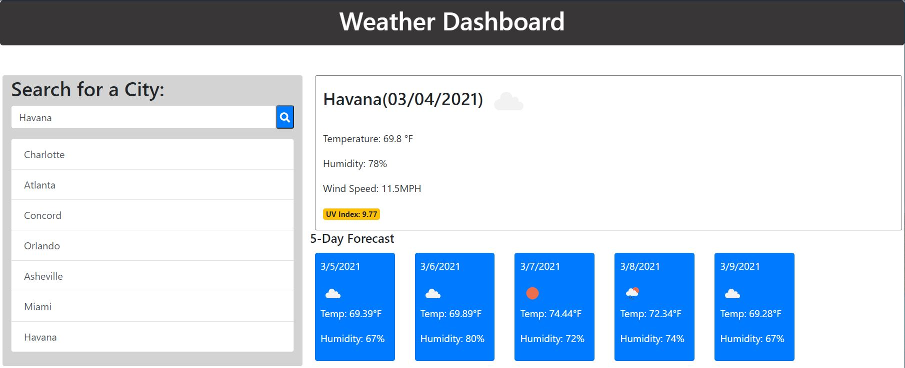

# Weather-Dashboard
AS A traveler, I need plan a trip accordingly, I WANT to see the weather outlook for multiple cities. That is exactly the purpose of this application.

## Table of contentens

* [Description](#Description)
* [Instalation](#Instalation)
* [Credits](Credits)
* [Mock-Up](#Mock-Up) 

## Description
- A weather dashboard which displays current weather and forecast for a searched city. Users can search for a city, and if found the app will return the current weather, as well as a forecast of the next 5 days. The user's search history is saved as a button for them to quickly check the weather of that city again.
- Following the requirements, I created the code in HTML and JavaScript trying to have a clean and polished, responsive user interface that adapts to multiple screen sizes.
- I commented each step creating the code for futures developers understand.

## Instalation
- [Link to Github Repository](https://github.com/Lauracejas/Weather-Dashboard)

- [Link to deployed website](https://lauracejas.github.io/Weather-Dashboard/)

## Credits

 - [openweathermap.org](.https://openweathermap.org/api)
 - [getbootstrap.com](.https://getbootstrap.com/docs/4.5/getting-started/introduction/) 
 - [developer.mozilla.org](.https://developer.mozilla.org/en-US/docs/Web/JavaScript/Reference/Global_Objects) 
 

## Mock-Up

